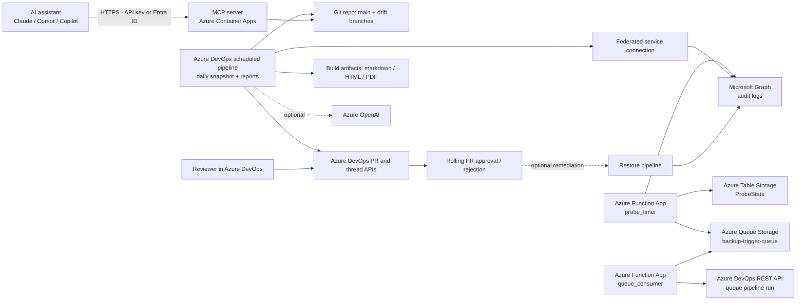

# ASTRAL Security Review Package

Prepared: 2026-06-07

## Purpose

This document describes the security posture of ASTRAL, an Intune / Entra drift backup, review, and remediation platform implemented in this repository.

ASTRAL stands for:

- Admin Security: Tenant Review, Automation & Lifecycle

The goal of the platform is to:

- export Microsoft Intune and selected Entra ID configuration from a production tenant,
- store approved configuration snapshots in Git,
- surface drift through rolling pull requests,
- optionally restore tenant configuration back to the approved baseline.

This package is intended for customer security review of the full product and its available deployment modes.

## Executive Summary

ASTRAL is an Azure DevOps pipeline based administrative workflow, not a customer-facing application and not an endpoint agent.

Key characteristics:

- The core backup, review, and restore pipelines are outbound-only scheduled jobs from Azure DevOps to Microsoft Graph and Azure DevOps APIs — no inbound endpoint.
- The MCP server (optional) is the one exception: it is an HTTPS inbound endpoint hosted on Azure Container Apps that exposes tenant state and drift history to AI assistants. It is protected by API key or Entra ID bearer token authentication.
- The default backup/review path is read-oriented against Microsoft Graph.
- A separate restore path can write configuration back to the tenant, but only through the dedicated restore pipeline and only when enabled and authorized.
- AI-assisted PR summaries are optional and are not required for backup, review, or restore.
- The public source repository is available at https://github.com/cqrenet/astral.

## Deployment Modes

The repository can be deployed progressively. It does not need to be introduced as an all-or-nothing package.

| Mode | Scope | Graph Access Profile | Azure DevOps Scope | AI | MCP Server |
| --- | --- | --- | --- | --- | --- |
| Backup-only | Export tenant configuration, generate reports, retain Git-tracked snapshots | Read-only | Repository and scheduled pipeline only | Disabled | Optional |
| Review package | Backup-only plus rolling PR review, reviewer summaries, optional change-ticket threads, reviewer `/accept` and `/reject` processing | Read-only | Repository, PR workflows, review-sync pipeline | Optional | Optional |
| Full package | Review package plus restore pipeline, rollback support, selective remediation, and optional auto-remediation | Read + Write for restore path only | Repository, PR workflows, review-sync, restore pipeline | Optional | Optional |

Important clarifications:

- AI is an add-on, not a core dependency.
- Restore is a separate capability, not a requirement for backup or review.
- Organizations can adopt the platform progressively, starting with backup-only and adding review or restore capabilities later.
- AI can be enabled or disabled independently of the backup, review, and restore layers.

## System Overview

### In-Scope Components

| Component | Function | Security Relevance |
| --- | --- | --- |
| Azure DevOps pipeline `azure-pipelines.yml` | Scheduled backup, drift commit, rolling PR management | Main execution path |
| Azure DevOps pipeline `azure-pipelines-review-sync.yml` | Processes reviewer `/reject` and `/accept` decisions and refreshes PR summaries | Uses Azure DevOps API token |
| Azure DevOps pipeline `azure-pipelines-restore.yml` | Restores approved baseline to tenant | Write-capable path |
| Azure Function App (`infra/change-probe`) | Event-driven probe: polls audit logs, debounces, triggers backup pipeline on demand | Outbound-only; uses separate Entra app registration |
| Azure Table Storage | Persists probe debouncer state (`ProbeState` table) | No sensitive tenant data |
| Azure Queue Storage | Receives trigger messages from probe timer for queue consumer | No sensitive tenant data |
| Azure DevOps Git repository | Stores approved baseline, drift branches, JSON exports, reports, docs | Primary configuration store |
| Microsoft Graph | Source of Intune and Entra configuration; optional target for restore; audit log source for probe | Production tenant access |
| Azure DevOps REST APIs | PR creation/update, review thread sync, restore queueing, pipeline trigger | Change-management control plane |
| Optional: MCP server (`infra/mcp-server`) | Azure Container Apps-hosted HTTPS endpoint exposing tenant state and drift history to MCP-capable AI assistants | First and only inbound endpoint in the platform; protected by API key or Entra ID bearer token; read-only access to Git data via ADO REST API |
| Optional: Azure Container Registry | Hosts the MCP server container image built during provisioning | Image supply chain — should be scoped to the deployment subscription |
| Azure DevOps pipeline `azure-pipelines-reports.yml` | Nightly report and documentation generation; commits reports to `main` | Read-only against Git data; no Graph write access |
| Optional Azure OpenAI | PR summary generation only | Optional data egress path |

### High-Level Flow



## Deployment Model

### Backup and Review

The main pipeline runs daily at 02:00 on `main` to generate a full tenant snapshot, reports, and documentation artifacts. It is also triggered on demand by the change probe when drift is detected (see the Change Probe section below).

- Daily at 02:00: export Intune and Entra configuration, generate reports, commit drift to rolling workload branches, and update one rolling PR per workload.
- When delayed reviewer notifications are enabled, newly created rolling PRs are opened as Azure DevOps draft PRs, the automated summary is inserted, and the PR is then published for reviewer notification.
- At the configured full-run hour: perform the same work plus documentation artifact generation (Markdown, and optionally HTML/PDF if browser dependencies are available).

The workload branches are:

- `drift/intune`
- `drift/entra`

Reviewers approve or reject drift through Azure DevOps pull requests. The system is intentionally ex-post change management: admins may make changes in the Microsoft admin portals, and this system detects, records, and routes those changes for review.

### Change Probe

The change probe is an event-driven trigger for the backup pipeline. Without it, the backup pipeline runs only on its daily schedule. With it, the pipeline is also queued automatically whenever real configuration changes are detected in the tenant.

#### Why it exists

Microsoft Graph change notifications and delta queries do not support Intune device management or Conditional Access resources, so a polling architecture against audit logs is used instead of a push-notification model.

#### Architecture

The change probe is implemented as an Azure Function App with two functions:

- **`probe_timer`** — runs on a 5-minute timer. Calls Microsoft Graph to read recent Intune and Entra audit log entries. Evaluates a debouncer state machine to determine whether a backup should be triggered.
- **`queue_consumer`** — triggered by a message on an Azure Queue Storage queue. Calls the Azure DevOps REST API to queue the backup pipeline.

State is persisted in an Azure Table Storage table (`ProbeState`, singleton row `default`).

#### Debouncer state machine

The debouncer prevents backup storms during bulk changes:

```
idle  →  (audit log activity detected)  →  armed
armed →  (15-minute quiet window elapses with no new activity)  →  emit queue message  →  cooldown
cooldown  →  (30-minute cooldown elapses)  →  idle
```

- **Idle**: no recent audit activity. No action.
- **Armed**: activity detected; waiting for the tenant to settle. Timer continues polling. If more activity arrives, the quiet window resets.
- **Cooldown**: a backup has been queued. No further triggers until cooldown elapses, preventing rapid re-queues during bulk changes.

#### Authentication and identity

The change probe uses a **dedicated Entra app registration** (`ASTRAL Change Probe`) that is completely separate from the pipeline service connection identity used for backup and restore.

- The app registration is created by `deploy/provision-change-probe.ps1`.
- It authenticates to Microsoft Graph using a **client secret** stored as an Azure Function App application setting (`PROBE_APP_SECRET`). The secret is not stored in the repository.
- It authenticates to Azure DevOps using an ADO PAT (`ADO_TOKEN`) stored as an Azure Function App application setting.
- Neither credential is present in the repository or in pipeline variables.

Required Microsoft Graph application permissions (read-only):

- `AuditLog.Read.All` — reads Intune and Entra audit logs
- `DeviceManagementApps.Read.All`
- `DeviceManagementConfiguration.Read.All`
- `DeviceManagementManagedDevices.Read.All`
- `Policy.Read.All`
- `Policy.Read.ConditionalAccess`
- `Application.Read.All`

The probe has no write permissions. It cannot modify any tenant configuration, queue a restore, or access the Git repository.

#### Network posture

The change probe is outbound-only. It makes HTTPS calls to:

- `graph.microsoft.com` (audit log polling)
- Azure Table Storage (debouncer state read/write)
- Azure Queue Storage (trigger message emit)
- Azure DevOps REST API (pipeline queue)

No inbound endpoint is created by the Function App for this purpose.

#### Identity isolation rationale

The probe uses a separate identity from the backup pipeline service connection deliberately:

- the probe requires `AuditLog.Read.All`, which the backup pipeline does not need,
- the backup pipeline service connection uses federated credentials (workload identity), while the probe uses a client secret appropriate for a long-running Function App,
- if the probe credentials are compromised, the blast radius is limited to audit log read access and the ability to trigger (not modify) the backup pipeline,
- the backup pipeline identity retains no ability to read audit logs or emit queue messages.

### Review Sync

The review-sync pipeline runs every 20 minutes on `main`.

It can:

- refresh automated PR summaries,
- process reviewer `/reject` or `/accept` commands in policy threads,
- optionally queue remediation after merge if rejected items were merged out of the PR scope.

### Restore

The restore pipeline is the only path that writes configuration back to the tenant.

It supports:

- full restore from `main`,
- selective restore of specific policy files,
- restore from a historical Git ref for rollback use cases,
- dry-run mode for report-only validation.

## Data Processed

### Data Categories

| Category | Examples | Source | Stored In |
| --- | --- | --- | --- |
| Intune configuration objects | compliance policies, device configurations, settings catalog, enrollment profiles, apps, scripts, filters, scope tags | Microsoft Graph / IntuneCD export | Git repo under `tenant-state/intune/**` |
| Entra configuration objects | conditional access, named locations, authentication strengths, app registrations, enterprise applications | Microsoft Graph | Git repo under `tenant-state/entra/**` |
| Generated reports | assignment inventories, object inventories, app inventories | Derived from exported configuration | `tenant-state/reports/**` and build artifacts |
| Documentation artifacts | split markdown, optional HTML/PDF | Derived from exported configuration | build artifacts |
| Review metadata | PR descriptions, review threads, accept/reject commands | Azure DevOps reviewers | Azure DevOps PR APIs |
| Probe state | debouncer state (timestamps, enum values) | Derived from audit log evaluation | Azure Table Storage (`ProbeState`) |
| Optional AI summary payload | sampled changed paths, semantic change descriptions, deterministic summary, fingerprints | Derived from repo diff | Azure OpenAI request payload |

### Data Sensitivity Notes

- The system is designed for administrative configuration data, not end-user business content.
- The repository can still contain sensitive operational material, including policy logic, group names, app identifiers, script bodies, custom configuration payloads, and administrator email addresses present in tenant configuration.
- If tenant-authored scripts or custom payloads contain embedded secrets, those secrets would also be captured. This is a customer governance risk, not something the exporter can reliably prevent.
- For that reason, the repository, drift branches, build logs, and published artifacts should all be treated as confidential administrative data.
- The same sensitivity assumptions apply to any AI summary payload because it is derived from the same administrative configuration changes.

## Authentication and Authorization

### Azure to Microsoft Graph

The pipelines obtain a Microsoft Graph access token at runtime using the Azure DevOps service connection configured in `SERVICE_CONNECTION_NAME` (e.g. `sc-astral-backup`).

The change probe uses a separate identity — see the **Change Probe** section under Deployment Model for the full authentication and permission model.

Observed controls in the implementation (backup/restore pipelines):

- token acquisition is performed at runtime with `Get-AzAccessToken`,
- token role claims are inspected before proceeding,
- the token is stored as a secret pipeline variable (`issecret=true`),
- missing required Graph roles cause early failure.

### Azure DevOps API Access

The pipelines use `System.AccessToken` for:

- creating and updating rolling PRs,
- reading and updating PR threads,
- queuing the restore pipeline.

The repository permissions documented in the implementation are:

- contribute,
- create branch,
- force push,
- create/update pull requests,
- optional create tag.

If restore auto-queue is enabled, the pipeline identity also needs:

- `View builds`,
- `Queue builds`,
- explicit pipeline authorization when enforced by the project.

### MCP Server Authentication

The MCP server (Azure Container Apps) supports two authentication modes:

**API key (default)**
A 32-character random key is generated during provisioning and injected as the `MCP_API_KEY` environment variable. Clients pass it via the `x-api-key` request header. Suitable for controlled internal use where the key can be securely distributed.

**Entra ID bearer token (recommended for production)**
Azure Container Apps built-in authentication is configured against the customer's Entra tenant. Clients pass a valid Entra bearer token. This integrates with the customer's existing identity and conditional access posture and is the recommended production mode.

The MCP server authenticates to Azure DevOps using an ADO PAT (`ADO_TOKEN`) scoped to Build read. It has no access to Microsoft Graph directly and cannot modify any data.

### Graph Permissions by Mode

#### Backup / Review Mode

Read-oriented Graph application permissions documented in the repository:

- `Device.Read.All`
- `DeviceManagementApps.Read.All`
- `DeviceManagementConfiguration.Read.All`
- `DeviceManagementManagedDevices.Read.All`
- `DeviceManagementRBAC.Read.All`
- `DeviceManagementScripts.Read.All`
- `DeviceManagementServiceConfig.Read.All`
- `Group.Read.All`
- `Policy.Read.All`
- `Policy.Read.ConditionalAccess`
- `Policy.Read.DeviceConfiguration`
- `User.Read.All`
- `Application.Read.All` for Entra app exports
- `RoleManagement.Read.Directory` or `Directory.Read.All` for richer enrichment
- `RoleEligibilitySchedule.Read.Directory` for PIM-eligible role assignment export (optional; permanent-only data is exported if missing)
- `AuditLog.Read.All` if commit author attribution is desired

#### Restore Mode

Write-capable Graph application permissions documented in the repository:

- `DeviceManagementApps.ReadWrite.All`
- `DeviceManagementConfiguration.ReadWrite.All`
- `DeviceManagementManagedDevices.ReadWrite.All`
- `DeviceManagementRBAC.ReadWrite.All`
- `DeviceManagementScripts.ReadWrite.All`
- `DeviceManagementServiceConfig.ReadWrite.All`
- `Group.Read.All`
- `Policy.Read.All`
- `Policy.ReadWrite.ConditionalAccess` when Entra updates are included

## Security Controls Present in the Implementation

### Network Exposure

- The core backup, review, and restore pipelines create no inbound application endpoint.
- The optional MCP server (Azure Container Apps) is the one inbound endpoint. It is HTTPS only and requires authentication (API key or Entra ID bearer token). It exposes a read-only view of Git-stored tenant state; it does not have write access to Microsoft Graph or Azure DevOps.
- Required outbound destinations for the pipelines:
  - `graph.microsoft.com`
  - Azure DevOps organization APIs
  - Azure Table Storage (for probe state)
  - Azure Queue Storage (for probe trigger messages)
  - optional Azure OpenAI endpoint
  - Python package registry for `IntuneCD`
  - npm registry for `md-to-pdf`
  - optional OS package repositories when HTML/PDF conversion needs Chromium libraries
- Required outbound destinations for the MCP server:
  - Azure DevOps REST API (reads `tenant-state/` from Git)

### Secrets Handling

- Graph tokens are obtained just-in-time rather than stored in the repository.
- The pipeline marks the Graph token as a secret variable.
- The implementation logs token claims and roles for diagnostics, but not the token value itself.
- The change probe app secret and ADO token are stored as Azure Function App application settings, not in the repository — see the Change Probe section for the full credential model.
- Azure OpenAI uses a pipeline secret variable when enabled.
- The pipeline logic itself does not depend on repository-stored application secrets; separate secret scanning of exported tenant content is still recommended.

### Change Control

- Drift is committed to dedicated rolling branches rather than directly to `main`.
- Review happens through rolling pull requests into `main`.
- The implementation can delay reviewer notification by creating new rolling PRs as drafts until the automated summary block is present, reducing generic first-notification content.
- Optional file-level change tickets can be enforced through auto-created PR threads.
- Reviewers can explicitly accept or reject individual configuration files.
- Generated reports are excluded from drift commits and PR diffs to reduce review noise.

### Safety Checks

- Backup jobs validate expected outputs before committing drift.
- Intune backup logic checks for unauthorized Graph 403 responses and fails unless the failure is explicitly allowed by configuration.
- Entra export logic is configured to fail on requested export errors to avoid partial snapshots.
- Restore validates required write permissions before running.
- Selective restore sanitizes requested paths and rejects path traversal or missing-file conditions.
- Restore supports dry-run mode before any tenant change is applied.

### Auditability

- Git history retains approved baseline snapshots.
- Rolling PR history provides reviewer decisions and rationale.
- Azure DevOps build history records pipeline runs and restoration events.
- Optional tags can be created for snapshots.

## Optional Azure OpenAI Integration

Azure OpenAI is used only for PR review narrative generation.

Important scoping facts from the implementation:

- the feature is optional and controlled by pipeline variables,
- the core backup/review/restore workflow does not depend on it,
- it can remain disabled in every deployment mode,
- only a reduced, budget-limited change payload is sent,
- the payload contains changed paths, semantic summaries, risk labels, fingerprints, and deterministic summary text,
- it does not need direct Microsoft Graph access,
- it can be disabled with `ENABLE_PR_AI_SUMMARY=false`.

### Intended AI Deployment Posture

The intended security posture for AI is not an opaque third-party black-box service. The implementation is designed to use a customer-controlled Azure OpenAI deployment defined by:

- `AZURE_OPENAI_ENDPOINT`
- `AZURE_OPENAI_DEPLOYMENT`
- `AZURE_OPENAI_API_KEY`

In the intended production design:

- AI requests are sent to the customer's Azure OpenAI resource,
- the model endpoint is explicitly configured by the customer,
- the AI service is a bounded summarization component rather than a system of record,
- Graph access remains with the pipeline and is not delegated to the model.

For formal security documentation, the safest statement is:

- the system is intended to use customer-managed Azure OpenAI infrastructure, typically within the same Azure tenant or controlled Azure environment, rather than an unrelated public AI service.

### AI Security Considerations

From a security perspective, the AI feature changes the system in these specific ways:

- it introduces an additional outbound destination: the configured Azure OpenAI endpoint,
- it sends a derived review payload based on configuration drift rather than raw tenant-wide exports,
- it does not grant the AI service direct credentials to Microsoft Graph or Azure DevOps,
- it is advisory only and does not approve, merge, reject, or restore changes by itself,
- it can be disabled independently of the rest of the platform.

### AI Business Purpose

The AI summaries exist to make technical Intune and Entra drift understandable to non-technical reviewers.

Their intended audience includes:

- project managers,
- delivery leads,
- security managers,
- customer management stakeholders,
- reviewers who own risk acceptance but do not work daily with raw policy JSON.

The purpose is not to replace technical review. The purpose is to provide a manager-readable explanation of:

- what changed,
- why it matters operationally,
- whether the change appears routine, risky, or potentially security-relevant,
- what a reviewer should verify before approval.

This allows management or PM stakeholders to participate meaningfully in review without needing to parse raw technical policy structures.

## Residual Risks and Customer Decisions

The following items are not fully solved by the repository alone and should be addressed in the customer deployment decision:

| Area | Current State | Recommended Position |
| --- | --- | --- |
| Restore capability | Supported by design; can change production tenant state | Keep restore manual only, or disable auto-remediation by default until operational controls are approved |
| Backup vs restore identity separation | Sample config uses the same service connection name in backup and restore pipelines | Use separate service principals: read-only for backup/review, write-enabled only for restore |
| Change probe identity separation | Probe uses a separate Entra app registration from the pipeline service connection | Keep probe app read-only; do not grant write permissions to the probe identity |
| Azure OpenAI egress | Optional and customer-configurable | Enable only when the organization approves the payload scope and Azure OpenAI deployment model |
| Artifact retention | Not defined in repo; inherited from Azure DevOps settings | Set explicit retention for builds, logs, and artifacts |
| Repo access model | Not defined in repo | Restrict repo and artifact access to administrators/reviewers only |
| Build agent hardening | Pool name exists, but agent type and hardening are deployment-specific | Prefer dedicated hardened agent or approved Microsoft-hosted configuration |
| Runtime package download | `pip`, `npm`, and sometimes `apt-get` are used during pipeline runs | Pre-bake dependencies into the agent image if customer forbids runtime internet package fetches |
| Secret content inside exported scripts | Possible if tenant admins embed secrets in Intune scripts or custom payloads | Review tenant script hygiene before onboarding |

## Recommended Deployment Configuration

For a conservative production deployment, use this profile:

1. Enable backup and review workflows.
2. Enable Azure OpenAI summaries only when a customer-controlled Azure OpenAI deployment is approved.
3. Disable automatic remediation queueing.
4. Do not authorize the restore pipeline for automatic queueing.
5. Use a read-only Graph application identity for backup/review.
6. Keep restore on a separate manual path with a separate write-enabled identity.
7. Apply Azure DevOps branch policies so `main` requires reviewer approval.
8. Set explicit retention and access-control policies for:
   - Git repository
   - build logs
   - markdown/HTML/PDF artifacts

Suggested conservative variable posture:

```text
ENABLE_PR_AI_SUMMARY=<true|false according to approved deployment mode>
AUTO_REMEDIATE_ON_PR_REJECTION=false
AUTO_REMEDIATE_AFTER_MERGE=false
REQUIRE_CHANGE_TICKETS=true
```

## Out of Scope

This repository does not provide:

- endpoint malware protection,
- customer device telemetry collection,
- user authentication to a SaaS application,
- network ingress services,
- a standalone secrets vault,
- customer-managed key support within the application itself.

Those controls, where needed, come from Azure DevOps, Microsoft 365 / Entra, the chosen agent environment, and the customer's broader platform governance.

## Customer-Specific Items to Fill Before Sending

The following are deployment-specific and should be completed with the actual customer environment:

- Azure DevOps organization and project name
- whether the agent pool is Microsoft-hosted or self-hosted
- repo retention period
- build log retention period
- artifact retention period
- named reviewer groups and branch policies
- exact service principal names used for backup and restore
- which Azure OpenAI resource and deployment are used, if AI is enabled
- whether restore is manual-only or fully enabled

## Repository Evidence

The statements in this document are based on the implementation in:

- `README.md`
- `azure-pipelines.yml`
- `azure-pipelines-review-sync.yml`
- `azure-pipelines-restore.yml`
- `scripts/update_pr_review_summary.py`
- `scripts/apply_reviewer_rejections.py`
- `scripts/queue_post_merge_restore.py`
- `scripts/export_entra_baseline.py`
- `scripts/export_entra_identity.py`
- `scripts/astral_mcp_tools.py`
- `scripts/probe_tenant_changes.py`
- `scripts/trigger_backup_pipeline.py`
- `infra/change-probe/probe_timer/__init__.py`
- `infra/change-probe/queue_consumer/__init__.py`
- `infra/mcp-server/mcp_server.py`
- `infra/mcp-server/README.md`
- `deploy/provision-change-probe.ps1`

The public source repository is available at https://github.com/cqrenet/astral.
